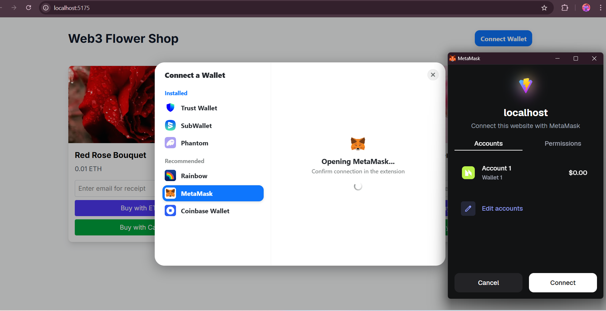

# Web3 Flower Shop 🌸
*A demo project for **Meetup SKG JS** showcasing Web3 integration in modern web applications.*



## 📖 Overview

This project demonstrates how to bridge the gap between traditional e-commerce and the decentralized web (Web3). Built for the **SKG JS Meetup**, it serves as a practical example of integrating cryptocurrency payments, wallet connections, and off-chain verified actions (email receipts) into a user-friendly React application.

We used **RainbowKit** for a best-in-class wallet connection experience, bypassing common implementation headaches like infinite spinners or detection issues.

## 🚀 Impact & Purpose

The transition to Web3 is often seen as complex and inaccessible. This project aims to demystify the process by showing:
- **Seamless Integration**: How Web3 libraries (Wagmi, Viem) can coexist with standard web stacks (React, Vite).
- **Real-World Utility**: Facilitating goods exchange for crypto assets (ETH on Sepolia).
- **Hybrid Architecture**: Combining on-chain trust (transactions) with off-chain convenience (email notifications, database records).

## 🛠️ Tech Stack

### Frontend
- **Framework**: [Vite](https://vitejs.dev/) + [React](https://react.dev/)
- **Styling**: [TailwindCSS](https://tailwindcss.com/)
- **Web3**: 
    - [RainbowKit](https://www.rainbowkit.com/) (Wallet UI)
    - [Wagmi](https://wagmi.sh/) (React Hooks)
    - [Viem](https://viem.sh/) (EVM Interfaces)
- **Language**: TypeScript

### Backend
- **Server**: Node.js + [Express](https://expressjs.com/)
- **Database**: [PostgreSQL](https://www.postgresql.org/) (pg)
- **Email**: [Nodemailer](https://nodemailer.com/) (Ethereal for testing)

## ⚙️ How It Works

1. **Connect Wallet**: Users connect their Ethereum wallet (MetaMask, Rainbow, etc.) using the persistent connect button powered by RainbowKit.
2. **Select Item**: Users choose a flower arrangement to purchase.
3. **Payment**:
    - **Crypto**: Initiates a transaction on the blockchain (Sepolia Testnet) to a designated merchant address.
    - **Fiat**: Simulates a credit card payment (mock implementation).
4. **Verification**: The frontend waits for transaction confirmation on the blockchain.
5. **Receipt**: 
    - Once confirmed, the frontend sends the transaction hash and user email to the backend API.
    - The backend verifies the data, logs it to the database, and sends a formatted email receipt to the user.

## 🏃‍♂️ Getting Started

### Prerequisites
- Node.js (v18+)
- pnpm (or npm)
- PostgreSQL database running locally

### 1. Clone & Install
```bash
git clone <repository-url>
cd web3-flower-shop
```

### 2. Frontend Setup
Navigate to the root directory and install dependencies:
```bash
pnpm install
```
Start the development server:
```bash
pnpm run dev
```
*Frontend runs on http://localhost:5173 (or 5175 if cached)*

### 3. Backend Setup
Navigate to the server directory:
```bash
cd server
npm install
```
Start the backend server:
```bash
npm start
```
*Backend runs on http://localhost:3001*

### 4. Database Setup
Ensure you have a PostgreSQL database named `web3_flower_shop` running on port `5432`.
The application will attempt to insert into a `transactions` table. You may need to create it:
```sql
CREATE TABLE transactions (
    id SERIAL PRIMARY KEY,
    email VARCHAR(255) NOT NULL,
    flower_name VARCHAR(255) NOT NULL,
    amount VARCHAR(50) NOT NULL,
    currency VARCHAR(10) DEFAULT 'ETH',
    tx_hash VARCHAR(255),
    created_at TIMESTAMP DEFAULT CURRENT_TIMESTAMP
);
```

### 5. Environment Variables
Create a `.env` file in the root directory if needed for custom configurations (Database credentials, WalletConnect Project ID).

## 📄 License

MIT License - feel free to use this code for your own learning and projects!
